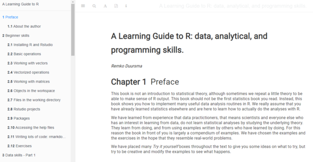

# Schema

.pull-left[

## Workshop 1

*Ochtend* 

- .large[Project management: Rstudio projects]
- .large[Version control with *git*]

*Middag*

- .large[Project management: file organization and workflow]
- .large[Automated reporting with *rmarkdown*]

## Workshop 2

*Ochtend*

- .large[Mastering package dependencies]
- .large[Writing functions: batch analysis]

*Middag*

- .large[Writing functions: code organization]
- .large[*Onderwerp(en) naar keuze / interesse*]

]

.pull-right[

  
]

---

background-image: url(images/classroom.jpg)
class: fitbackground

# Jullie!

---

background-image: url(images/shanghairoads.jpg)
class: fitbackground

# Leer op je eigen manier

---

# Resources

- **Bookmark this site** : https://remkoduursma.github.io/cjib

.center[]

