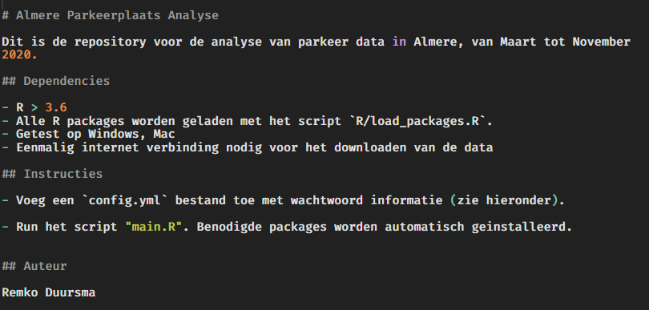

<style>
.smaller{
	font-size: 10px;
}
.mediumsmall{
  font-size: 15px;
}

</style>

## Een "Goed" project


> 1. **Reproducable** : de analyse kan uitgevoerd worden op een andere machine, door een andere gebruiker, en/of (ver) in de toekomst
> 2. Duidelijke **instructies**: hoe runnen we de analyse? Wat zijn de vereisten? Waar komen de outputs terecht?
> 3. Logische **folder** structuur (code / data / output / settings)
> 4. Een **main** script, waarmee de gehele analyse gestart kan worden
> 5. Alleen **noodzakelijke** scripts in het project, geen rotzooi
> 6. Gebruik van **functions** om code in logische brokken te organiseren
> 7. Gebruik van een simpele **cache** om langdurende stappen op te slaan
> 8. Sla project configuratie op in een apart bestand (bv. YAML)
> 9. Version control
> 10. Gebruik van duidelijke **namen** voor objecten, data, functies


## Reproducable research

- Een ideaal project kan met gemak door een andere gebruiker gerund worden
- Het is 100% duidelijk welke code welke output (figuren, data, etc.) geproduceerd heeft
- Een project moet in 1 folder georganiseerd zijn, met meerdere subfolders. Hierdoor kun je een project makkelijk verplaatsen, delen, en met *version control* beheren.


## Reproducable research (2)

Er zijn een aantal uitdagingen om een project zonder veel aanpassingen op een andere machine uit te voeren. Een aantal hiervan zijn,

1. **Platform**. Werkt het project alleen op Windows?
2. Is er behalve R andere **software** nodig? (Sommige R packages hebben ook systeem vereisten!)
4. **R Packages**. Zijn de package afhankelijkheden minimaal? Zijn alle packages beschikbaar op CRAN?
5. Blijft het project werken als een nieuwere versie van een package is geinstalleerd?
5. Zijn er **wachtwoorden** nodig, bv. voor database toegang?


## Instructies

Is er voldoende informatie om door iemand anders het project uit te laten voeren?

Behalve genoeg *comments* in de code, schrijf voor elk project een `README.md`, bv.:


  


```{r, class.source="smaller", eval = FALSE, include=FALSE}

# Almere Parkeerplaats Analyse

Dit is de repository voor de analyse van parkeer data in Almere, van Maart tot November 2020.

## Dependencies

- R > 3.6
- Alle R packages worden geladen met het script `R/load_packages.R`.
- Getest op Windows, Mac
- Eenmalig internet verbinding nodig voor het downloaden van de data

## Instructies

- Voeg een `config.yml` bestand toe met wachtwoord informatie (zie hieronder).

- Run het script "main.R". Benodigde packages worden automatisch geinstalleerd.


## Auteur

Remko Duursma

```


## Logische folder structuur

Er zijn veel mogelijkheden om de verschillende bestanden in een project te verdelen in een logische folder structuur.

Dit is belangrijk:

- Houd *code*, *data*, en *output* altijd gescheiden

Een minimaal voorbeeld:

  


Er is 1 hoofd script, "analysis.R", waarin alle analyses worden uitgevoerd.
Verder is alles ondergebracht in sub-folders.


## Werken met folders


Gebruik nooit een compleet path naar je bestanden, bv:

```{r, eval=FALSE}
# Doe dit niet
mydata <- read.csv("c:/users/remko/project1/data/bestand1.csv")
```

Dit werkt niet op een andere machine.

Folders binnen je project folder kun je met een "relatief" path opvragen:

```{r, eval=FALSE}
mydata <- read.csv("rawdata/bestand1.csv")
```


## Main script

Om andere scripts te runnen kun je `source` gebruiken. Op deze manier krijgt een hoofd script een duidelijke structuur.

```{r eval=FALSE, source.class ="mediumsmall"}
# Load packages
source("R/load_packages")

# Laad eigen functies.
source("R/functions.R")

# Configuratie
conf <- yaml::read_yaml("passwords.yml")

# Lees de ruwe data
main_data <- read_raw_data(conf)

# Make figures
source("R/make_figures.R")

# Regressie modellen
source("R/linearmodels.R")
```


## Geen rotzooi


- Verwijder bestanden die je niet meer nodig hebt in het project.

- Sla *backups* van het project ergens anders op.

- Het idee is dat je een project netjes en "portable" maakt, zodat het makkelijk later / door iemand anders gebruikt kan worden.

- Met *git* kun je altijd oude code terugvinden, bv (vanuit bash):

```
git log -G verlorenfunctie
```

Met dit command zoekt *git* waar "verlorenfunctie" voorkomt in veranderde code (bv. waar de code was verwijderd).


## Functies maken de flow van informatie duidelijk

Welke outputs zijn gebaseerd op welke inputs?

```{r eval=FALSE}
# Lees configuratie
.conf <- yaml::read_yaml("config.yml")

# Download ruwe data
almere_parking_raw <- download_almere_parking_data(.conf)

# Schone versie
almere_parking <- clean_almere_data(almere_parking_raw)

# Maak Figuur 1 (overzicht)
to.pdf(
  figure1(data = almere_parking), 
  filename = "output/figure1.pdf"
)

```


## Functies houden het geheugen schoon

Stel dat we deze functie hebben gemaakt om een dataset in te lezen:

```{r}
download_almere_parking_data <- function(conf){
  
  passw <- conf$password
  
  db <- DBI::dbConnect(database = "db.almere.nl",
                       password = passw)
  
  data <- dbReadTable(db, "almere_parking_current")
  
  dbDisconnect(db)
  
return(data)
}
```


## Functies houden het geheugen schoon (2)


Als deze functie nu (vanuit een master script) wordt aangeroepen,

```{r eval=FALSE}
almere_parking_raw <- download_almere_parking_data(.conf)
```

Dan zijn de objecten `passw`, `db` en `data` **niet** beschikbaar in het 'global environment'. Deze objecten bestaan alleen tijdens de functie executie.


## Functies houden het geheugen schoon (3)

Door het global environment niet te vervuilen met allerlei tijdelijke objecten, vermijden we:

- *conflicten* : ik gebruik hier "data" als naam voor een object binnen een functie! Dit is veilig omdat dat object alleen binnen de functie bestaat. 
- *lekkage* van gevoelige info (het wachtwoord staat nu ook in `passw`!)
- *overmatig gebruik van geheugen* : Grote objecten die alleen tijdelijk nodig zijn kunnen het beste binnen een functie gebruikt worden, dan komt het geheugen weer vrij als de functie klaar is.


## Gebruik een (simpele) cache voor langdurende stappen {.build}

- Vaak zijn een of meerdere stappen in een analyse tijdrovend. We slaan het liefst deze stappen over als we het hele project runnen.

- Gebruik nooit de setting in Rstudio (Tools/Global Options/General/Workspace) om automatisch oude objecten te laden.

- Gebruik altijd **RDS** om objecten tijdelijk mee op te slaan. Dit zijn exacte kopieen van objecten in R.

- Schrijf je eigen simpele systeem (volgende slide) om optioneel data te lezen uit een *cache*.

- Of kijk naar `drake`, een geavanceerd systeem om een workflow te definieren, en alleen objecten opnieuw te maken wanneer nodig (https://github.com/ropensci/drake).


## Gebruik een (simpele) cache voor langdurende stappen (2)


```{r eval = FALSE}

slow_process <- function(){
  # Een langdurende functie, of een functie die niet altijd werkt
  # Bv: internet verbinding nodig.
}

fn <- "cache/slow_object.rds"

if(!file.exists(fn)){
  slow_object <- slow_process()
  saveRDS(slow_object, fn)
} else {
  slow_object <- readRDS(fn)
}

```

Simpeler wordt het niet. Om de cache niet te gebruiken, verwijder alle bestanden in `cache/`.


## Sla configuratie op in een apart bestand

Veel projecten gebruiken allerlei settings, zoals wachtwoorden, data lokaties, model versies, kleuren, etc.

**Verzamel** alle settings in een centrale lokatie, op zijn minst een apart script, of vaak handiger in een apart bestand in YAML format:


```
database:
  user: remkoduursma
  password: 123hello123
  table: almere_parking

colors:
  barplot: ["red","green","blue"]

```


## Sla configuratie op in een apart bestand (2)


Sla dit op als bv. `config.yml`, en lees het in met:

```
.conf <- yaml::read_yaml("config.yml")
```

De settings zijn nu ingelezen als een *list*, bv. `.conf$database$table`.


## Alles heeft een naam

Het is heel belangrijk voor leesbare scripts om goede namen te gebruiken. 

Doe dit **niet**:

- *Te* algemene namen voor objecten (`data`, `summary`, `dataset`)
- Korte namen (`d`, `y`, `y2`)
- Gebruik van symbolen (gebruik alleen letters, cijfers, `_`)

Doe dit **wel**:

- Gebruik voor alle eigen objecten en functies *snake_case*

`read_almere_parking_data`, `convert_date_to_time`, `to_sql_string`, `figure1`

- Soms is *camelCase* populair, maar ik vind het in lange scripts veel minder leesbaar.


## Alles heeft een naam (2)

Het voorgaande geldt voor objecten die in het Global Environment beschikbaar zijn. Leesbare namen helpen om de code duidelijk te houden.

Binnen **functies** geldt een heel ander idee: hier kunnen argumenten juist heel algemeen zijn. 

Objecten binnen een functie zijn alleen zichtbaar binnen de functie.

```{r eval=FALSE}
append_database_row <- function(data, connection){
  
  dbWriteTable(connection, data, append = TRUE)
  
}
```

Omdat dit een heel algemene functie is, zijn argumenten `data` en `connection` juist prima.
Interne R functies hergebruiken ook veel standaard argument namen (`x`, `data`, etc.).


