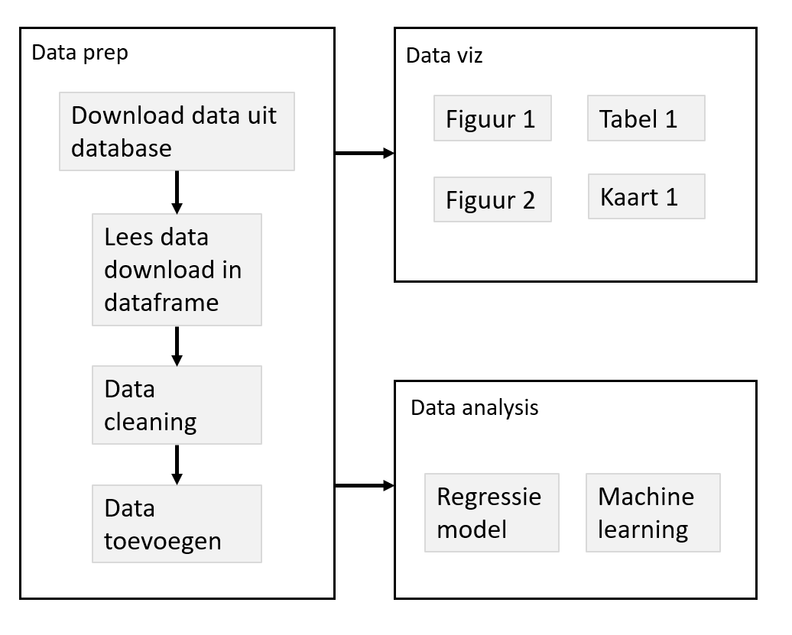

  
  
## R & Rstudio Advanced | "Dag" 2 - Deel 3

- Gebruik van functies voor een betere workflow
  - Motivatie
  - Wrapper functies voor plots
  - Caching / drake
  
- Functies: extra tips & tricks
  - Error handling
  - S3
  

## Project workflow

Een *goed* project:

- kan snel begrepen worden door anderen
- kan makkelijk aangepast worden (*config*)
- kan makkelijk uitgebreid worden
- delen van het project kunnen hergebruikt worden (*modulair*)

*Functies* zijn hier nuttig:

- Begrijpen van complexe code
- Duidelijk maken van *inputs* (argumenten) en *outputs* (`return()`)
- Functies helpen om complexe projecten *modulair* te maken

## Logische folder structuur

Er zijn veel mogelijkheden om de verschillende bestanden in een project te verdelen in een logische folder structuur.

Dit is belangrijk:

- Houd *code*, *data*, en *output* altijd gescheiden

Een minimaal voorbeeld:

  

Er is hier 1 hoofd script, "analysis.R", waarin alle analyses worden uitgevoerd.
Verder is alles ondergebracht in sub-folders.

## Project structuur

Organiseer de verschillende stappen, sub-stappen (sub-sub-stappen) voor een project.

## Voorbeeld 1

## Voorbeeld 2

