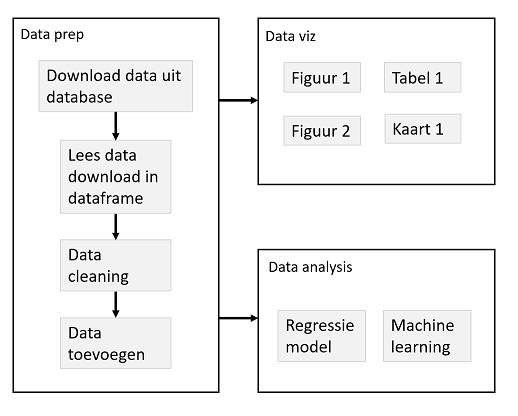
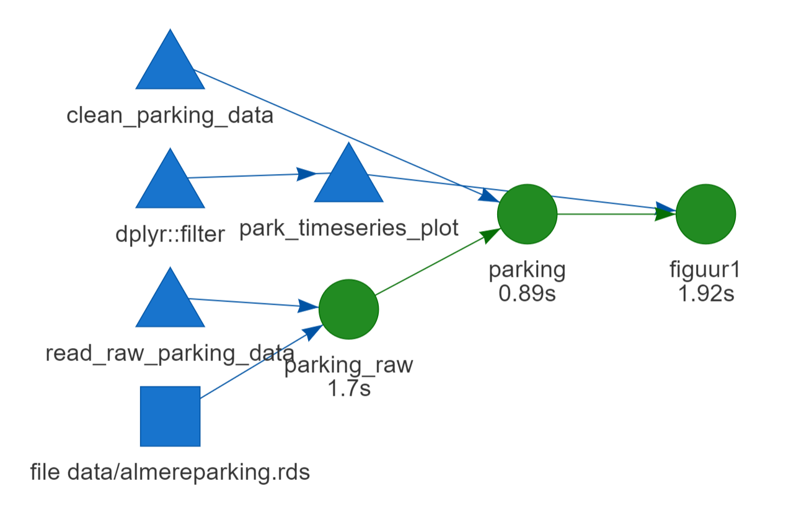

  
  
## R & Rstudio Advanced | "Dag" 2 - Deel 3

- Gebruik van functies voor een betere workflow
  - Motivatie
  - Wrapper functies voor plots
  - Caching / drake
  
- Functies: extra tips & tricks
  


## Project workflow

Een *goed* project:

- Kan snel begrepen worden door anderen
- Kan makkelijk aangepast worden (*config*)
- Kan makkelijk uitgebreid worden
- Onderdelen van het project kunnen hergebruikt worden (*modulair*)

*Functies* zijn hier nuttig:

- Begrijpen van complexe code
- Duidelijk maken van *inputs* (argumenten) en *outputs* (`return()`)
- Functies helpen om complexe projecten *modulair* te maken


## Logische folder structuur

Er zijn veel mogelijkheden om de verschillende bestanden in een project te verdelen in een logische folder structuur.

Dit is belangrijk:

- Houd *code*, *data*, en *output* altijd gescheiden

Een minimaal voorbeeld:


Er is hier 1 hoofd script, "analysis.R", waarin alle analyses worden uitgevoerd.
Verder is alles ondergebracht in sub-folders.


## Project structuur

Organiseer de logica van de verschillende stappen, sub-stappen (sub-sub-stappen) voor een project.




## Voorbeeld 1


```{r, eval=FALSE, eval=FALSE}
park <- arrange(parking_raw, updated) %>%
  filter(!label %in% c("P+R","P4") ) %>%
  mutate(label = as.factor(label),
         updated = as.POSIXct(updated, tz = "UTC"),
         week_time = (wday(updated) - 1) * 24*60 +
           60*(hour(updated)) + minute(updated),
         week_time_15 = floor(week_time / 15),
         Date = as.Date(updated))
```


## Voorbeeld 1


```{r, eval=FALSE}
# R/functions_clean_data.R
clean_parking_data <- function(data){
  
  data %>%
  arrange(updated) %>%
  filter(!label %in% c("P+R","P4") ) %>%
  mutate(label = as.factor(label),
         updated = as.POSIXct(updated, tz = "UTC"),
         week_time = (wday(updated) - 1) * 24*60 +
           60*(hour(updated)) + minute(updated),
         week_time_15 = floor(week_time / 15),
         Date = as.Date(updated))
}

# main.R
park <- clean_parking_data(parking_raw)
```


## Voorbeeld 2

```{r, eval=FALSE}
parking_hr <- group_by(park, Date, label, hour) %>%
    summarize(parked = mean(parked)) %>%
    ungroup %>%
    mutate(weekday = wday(Date, abbr=FALSE, label = TRUE),
           weekday = as.integer(factor(weekday, ordered = FALSE)))

model1 <- ranger(parked ~ hour + label + weekday, data = parking_hr, importance = "impurity")

out_dfr <- expand.grid(hour = hour_now,
                         weekday = wday(Sys.time()),
                         label = factor(c("P1","P10","P11","P12",
                                          "P2","P3","P5","P6","P7","P8","P9")))
  
predict(model, data = out_dfr)

```


## Voorbeeld 2

```{r, eval=FALSE}
# Maak uurlijkse data
parking_hr <- aggregate_parking_data(park)

# Fit model, met weekdag
model1 <- fit_randomforest_model(parking_hr, form = 1)

# Voorspellingen
predict_randomforest_model(model1)
```


## Reproducibility: langzame stappen

- Een *goed* project kan in 1 stap opnieuw uitgevoerd worden (bv. `source("main.R")`)
- *Alle* outputs kunnen opnieuw gemaakt worden op basis van de *code*

- Langzame stappen: liever maken we deze niet opnieuw wanneer dit niet nodig is

```{r, eval=FALSE}
# Super simpel systeem
cache <- "cache/slowstep.rds"
if(!file.exists(cache)){
  result <- make_slow_result()
} else {
  result <- readRDS(cache)
}
```


## Reproducibility: langzame stappen

- Beter: gebruik van een workflow manager systeem
- Straks: de `drake` package




## Functie types: generiek vs. project functies


- Generieke functies weten niets van je specifieke project, en kunnen overal worden gebruikt
- Gebruik van *namespace directive* (`dplyr::filter`), en `require` voor laden van packages is aan te raden.

- Project functies zijn specifiek voor dit project
- Om tijd te besparen kun je minder strict zijn in aanroepen packages, en alle packages simpelweg laden in `R/load_packages.R`


## Tot slot

- We kunnen *functies* gebruiken om onze lange code in logische brokken te verdelen
- Deze brokken hebben duidelijke *inputs* en *outputs* waardoor de samenhang van het project duidelijk wordt
- Dit maakt een zeer leesbaar 'hoofd' script mogelijk

- Houd je functies klein: een functie voert 1 operatie uit, met evt. opties.
- Het vinden van de juiste functies is niet makkelijk, er zijn meerdere mogelijkheden!


