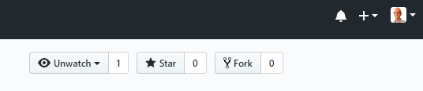

  
  
## Oefeningen

### 1. Github Fork

Ga naar Github, maak een **Fork** van de voorbeeld repository op 

    https://github.com/remkoduursma/cjibexample
  

  
Een **fork** is een kopie van de repository op je eigen account. Hiermee kun je oefenen zodat we niet allemaal tegelijkertijd op dezelfde code gaan werken.

### 2. Clone

Maak een **Clone** van de fork die je zojuist gemaakt hebt. Een clone is een kopie van een remote op je eigen machine. Maak de clone binnen een nieuw Rstudio project.


### 3. Rstudio git

Oefen de volgende acties:

- Verander / voeg code toe aan de bestaande bestanden (wat gebeurt er?)
- Voeg nieuwe bestanden toe (maak bv. nieuwe scripts met delen van het bestaande script)
- Voeg nieuwe folders toe. Zet in sommige folders minstens 1 bestand, laat een andere leeg (om te kijken wat er gebeurt).
- Maak een *commit* : eerst bestanden selecteren die je aan deze commit wilt toevoegen (*staging*, dmv bestanden aanvinken in Rstudio), dan op **Commit** menu klikken, een "commit message" schrijven, en klik op de Commit knop.
- Bewerk het `.gitignore` bestand: voeg hier bestanden aan toe die je **nooit** wilt meenemen. Oefen dit!
- Delete bestaande bestanden (die eerder zijn ge-commit), kijk wat er gebeurt.
- Doe een **Push** : de lokale repository wordt naar de remote gekopieerd.


### 4. Command line git

Herhaal bovenstaande stappen via de command line (Bash).

Maak eerst veranderingen, of voeg bestanden toe / verwijder bestanden.

Kijk naar de *status* :

```
git status
```

Dit geeft een samenvatting van de veranderde/toegevoegde bestanden.

Voor een commit, eerst de gewenste bestanden *stagen*, bv:

```
# 1 Bestand stagen
git add newfile.txt

# Alle reeds toegevoegde bestanden stagen voor de nieuwe commit:
git add -u

# Alle bestanden (ook nieuwe) stagen
# Doe dit alleen als je goed naar git status gekeken hebt!
git add .

```

Het is ook nuttig om te kijken welke bestanden er bijgehouden worden in git:

```
git ls-files
```

Nu dat de *staging* klaar is, kun je committen. Altijd goed om eerst nog naar `git status` te kijken!

```
git commit -m "Figuren bijgewerkt, code opgeschoond"
```

En uiteindelijk een push naar de remote (dit hoeft niet elke keer als je een commit hebt gemaakt!)

```
git push
```


### 5. Meer Command line

Behalve het onderstaande, lees ook [6.6 Using the command line](https://remkoduursma.github.io/learningguidetor/versioncontrol.html#commandline).

Probeer de volgende commands:

Check of je wel de juiste remote hebt geconfigureerd met:

```
git remote -v
```

Het is mogelijk om meerdere remotes toe te voegen (bv. zowel github als bitbucket).


```
git log
```

Dit geeft de geschiedenis van je repository. Als dit te lang is, druk `q` om te eindigen.

Probeer een oude commit te bekijken, bv. (maar gebruik hier de SHA van een van de commits in de `git log`):

```
git checkout abd45d
```

Je bent nu in "Detached HEAD" - je kunt alleen rondkijken. Dit is heel handig om verwijderde bestanden / code te bekijken, en kopietjes te maken die je later weer kunt terugzetten.

Probeer bijvoorbeeld een bestand te verwijderen, dit te committen, en later weer terug te kijken door een `git checkout` te doen.

Om weer terug te keren naar de meest recente commit,

```
git checkout master
```


### 6. Samenwerken

Lees eerst [Section 6.4.3.](https://remkoduursma.github.io/learningguidetor/versioncontrol.html#remotegit)

Zoek een (of twee) partners met wie je gaat samenwerken. Nodig ze uit via github: op je project, ga naar "Settings/Manage Access/Invite a Collaborator" (dat laatste is een groene knop).

Zorg er nu voor dat jij en je partner dit project ook lokaal draaiend hebben (maak dus een Clone).

Als je samenwerkt, kun je in principe werken zoals altijd, maar dit is belangrijk:

- Begin eerst met een **Pull**. Dit zorgt ervoor dat je de laatste versie van de remote op je machine draaiend hebt.

- Maak commits zoals je voorheen deed.

- Maak een **Push** : dit duwt jouw veranderingen naar de server. Je partner doet hetzelfde!

Als je nu verder werkt, en je wil weer een Push doen, gaat het voorkomen dat je partner dat ook heeft gedaan. Je krijgt dan een foutmelding dat "Updates were rejected because ... behind its remote ...".

Om verder te gaan, doe eerst een **Pull** - dit voegt jouw partner's veranderingen toe aan de jouwe. Als het goed is, gaat dat automatisch!


### 7. Samenwerken: conflicts

Samenwerken gaat goed, en makkelijk, zo lang je aan verschillende lijntjes code hebt gewerkt (zelfs binnen hetzelfde bestand is geen probleem).

Maar wat moet git doen als je dezelfde stukjes hebt veranderd?

Zorg ervoor dat jij en je partner dezelfde lijntjes code hebben veranderd, maak een commit / push / pull, en kijk wat er gebeurt!

Je kunt de **conflicts** handmatig repareren, en een nieuwe commit/push doen.


